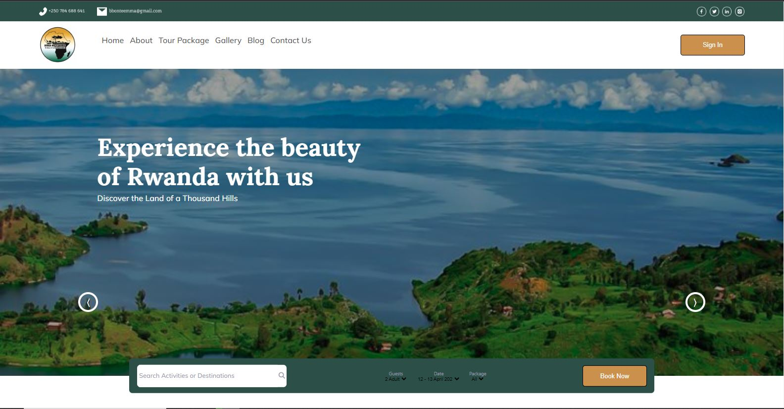

# 🌴 TOUR TO RWANDA 🌴

Tour to Rwanda is a website that provides information about tourism in Rwanda. The site is built with [Create React App](https://github.com/facebook/create-react-app).
The site is a great resource for people who are interested in learning more about Rwanda and its tourism industry. It includes information 📊 about the country's history, culture, wildlife, and natural attractions. The site is easy to use and navigate. The information is presented in a clear and concise way. The site also includes a blog section with articles about Rwandan tourism.

Here are some of the features of the site:

- Information about Rwanda's history, culture, wildlife, and natural attractions
- Tips for planning a trip to Rwanda
- A blog section with articles about Rwandan tourism
- Clean code standards
- Tests for all of the components

## Project Preview



## Deployment

You can view a deployment at <bold>[Tour to Rwanda](https://tourism-site-ekep-obasi.netlify.app)</bold>

## Getting Started

To get started with the tourism-site, simply clone the repository and install the dependencies. 

```sh
git clone https://github.com/Ekep-Obasi/Tourism-Website.git
```
```sh
cd Tourism-Website
```
```sh
npm run install
```
## Run Code

You can start the app by running the following command: 

```sh
npm run start
```
